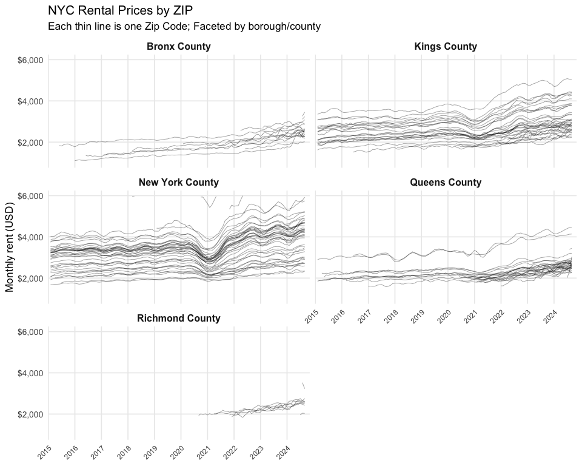

Homework 3 - P8105 Data Science I
================
Oct 11, 2025

- [Problem 1 – Instacart Data](#problem-1--instacart-data)
  - [Quick description of the
    dataset](#quick-description-of-the-dataset)
  - [1) How many aisles are there, and which aisles have the most items
    ordered?](#1-how-many-aisles-are-there-and-which-aisles-have-the-most-items-ordered)
  - [2) Plot: Aisles with most items](#2-plot-aisles-with-most-items)
  - [3) Table: Three most popular items in selected
    aisles](#3-table-three-most-popular-items-in-selected-aisles)
  - [4) Table: The mean purchase time](#4-table-the-mean-purchase-time)
- [Problem 2 – Zillow NYC Analysis](#problem-2--zillow-nyc-analysis)
  - [Import, clean, and tidy](#import-clean-and-tidy)
  - [Zip code analysis](#zip-code-analysis)
  - [Table: average rental price by borough and
    year](#table-average-rental-price-by-borough-and-year)
  - [Plot: Price change by boroughs](#plot-price-change-by-boroughs)
  - [Plot: Average rental price in
    2023](#plot-average-rental-price-in-2023)
  - [Export the plots](#export-the-plots)
- [Problem 3](#problem-3)

``` r
library(tidyverse)
library(janitor)
library(lubridate)
library(scales)
library(knitr)
library(gt)
library(patchwork)
```

## Problem 1 – Instacart Data

Load from `p8105.datasets`; **do not** keep a local copy of the dataset.

``` r
library(p8105.datasets)
data("instacart")

# show the data
instacart <- instacart %>% clean_names()
instacart
```

    ## # A tibble: 1,384,617 × 15
    ##    order_id product_id add_to_cart_order reordered user_id eval_set order_number
    ##       <int>      <int>             <int>     <int>   <int> <chr>           <int>
    ##  1        1      49302                 1         1  112108 train               4
    ##  2        1      11109                 2         1  112108 train               4
    ##  3        1      10246                 3         0  112108 train               4
    ##  4        1      49683                 4         0  112108 train               4
    ##  5        1      43633                 5         1  112108 train               4
    ##  6        1      13176                 6         0  112108 train               4
    ##  7        1      47209                 7         0  112108 train               4
    ##  8        1      22035                 8         1  112108 train               4
    ##  9       36      39612                 1         0   79431 train              23
    ## 10       36      19660                 2         1   79431 train              23
    ## # ℹ 1,384,607 more rows
    ## # ℹ 8 more variables: order_dow <int>, order_hour_of_day <int>,
    ## #   days_since_prior_order <int>, product_name <chr>, aisle_id <int>,
    ## #   department_id <int>, aisle <chr>, department <chr>

### Quick description of the dataset

``` r
# show data size and structure
instacart %>% 
  summarize(
    n_rows = n(),
    n_cols = ncol(.),
    unique_users = n_distinct(instacart$user_id),
    unique_orders = n_distinct(instacart$order_id)
  ) %>% 
  knitr::kable(format = "markdown")
```

|  n_rows | n_cols | unique_users | unique_orders |
|--------:|-------:|-------------:|--------------:|
| 1384617 |     15 |       131209 |        131209 |

The dataset contains detailed records of Instacart orders at the product
level (one row per product in an order), with variables for order
timing, aisle, department, product name, etc. It contains 131209 unique
users and 1384617 rows, where each row in the dataset is a product from
an order. There is a single order per user in this dataset.

Key variables include:

- order_id – Unique identifier for an order. Each row corresponds to a
  single product within that order.
- product_id – Unique numeric identifier for a specific product.
- add_to_cart_order – The sequence number of this product within its
  order (e.g., 1 = first item added, 2 = second).
- reordered – Binary indicator showing whether the user has purchased
  this product before (1 = yes, 0 = no).
- user_id – Unique identifier for a customer or Instacart user.
- order_number – The running count of orders placed by this user (1 =
  the user’s first order).
- order_dow – Day of the week the order was placed, coded 0–6 (0 =
  Sunday, 1 = Monday, … 6 = Saturday).
- order_hour_of_day – Hour of the day (0–23) when the order was placed.
- days_since_prior_order – Number of days since the user’s previous
  order (NA for their first order).
- product_name – Descriptive name of the product.
- aisle_id – Numeric ID corresponding to the aisle in which the product
  is categorized.
- department_id – Numeric ID corresponding to the department containing
  the aisle.
- aisle – Human-readable name of the aisle (e.g., “packaged vegetables
  fruits”).
- department – Human-readable name of the department (e.g., “produce”).

### 1) How many aisles are there, and which aisles have the most items ordered?

``` r
aisle_counts <- instacart %>% 
  count(aisle, sort = TRUE)

# Show aisle count
n_aisles <- aisle_counts %>% nrow()
n_aisles
```

    ## [1] 134

``` r
# Show aisles with most products ordered
head(aisle_counts, 10) %>% knitr::kable(format = "markdown")
```

| aisle                         |      n |
|:------------------------------|-------:|
| fresh vegetables              | 150609 |
| fresh fruits                  | 150473 |
| packaged vegetables fruits    |  78493 |
| yogurt                        |  55240 |
| packaged cheese               |  41699 |
| water seltzer sparkling water |  36617 |
| milk                          |  32644 |
| chips pretzels                |  31269 |
| soy lactosefree               |  26240 |
| bread                         |  23635 |

There are 134 aisles. The most-ordered aisles include those shown in the
table above (e.g., packaged vegetables/fruits, fresh fruits, etc.).

### 2) Plot: Aisles with most items

Make a plot that shows the number of items ordered in each aisle,
limiting this to aisles with more than 10000 items ordered. Arrange
aisles sensibly, and organize your plot so others can read it.

``` r
aisle_counts %>% 
  filter(n > 10000) %>% 
  mutate(aisle = fct_reorder(aisle, n)) %>% 
  ggplot(aes(x = aisle, y = n)) +
  coord_flip() +
  geom_col() +
  labs(
    x = NULL, y = "Items ordered",
    title = "Items ordered by aisle (>10,000)"
  ) +
  scale_y_continuous(
    trans = "sqrt",
    labels = label_comma(),
    limits = c(0, 160000)
  )
```

<!-- -->

### 3) Table: Three most popular items in selected aisles

Make a table showing the three most popular items in each of the aisles
“baking ingredients”, “dog food care”, and “packaged vegetables fruits”.
Include the number of times each item is ordered in your table.

``` r
selected_aisles <- c("baking ingredients", "dog food care", "packaged vegetables fruits")

top3_tbl <- instacart %>% 
  filter(aisle %in% selected_aisles) %>% 
  count(aisle, product_name, sort = TRUE) %>% 
  group_by(aisle) %>% 
  slice_max(n, n = 3, with_ties = FALSE) %>% 
  ungroup()

top3_tbl %>% 
  arrange(aisle, desc(n)) %>% 
  gt() %>% 
  cols_label(
    aisle = "Aisle",
    product_name = "Product",
    n = "Times ordered"
  ) %>% 
  tab_header(title = "Top 3 Products in Selected Aisles") %>%
  as_raw_html()
```

<div id="uncuamapbd" style="padding-left:0px;padding-right:0px;padding-top:10px;padding-bottom:10px;overflow-x:auto;overflow-y:auto;width:auto;height:auto;">
  &#10;  <table class="gt_table" data-quarto-disable-processing="false" data-quarto-bootstrap="false" style="-webkit-font-smoothing: antialiased; -moz-osx-font-smoothing: grayscale; font-family: system-ui, 'Segoe UI', Roboto, Helvetica, Arial, sans-serif, 'Apple Color Emoji', 'Segoe UI Emoji', 'Segoe UI Symbol', 'Noto Color Emoji'; display: table; border-collapse: collapse; line-height: normal; margin-left: auto; margin-right: auto; color: #333333; font-size: 16px; font-weight: normal; font-style: normal; background-color: #FFFFFF; width: auto; border-top-style: solid; border-top-width: 2px; border-top-color: #A8A8A8; border-right-style: none; border-right-width: 2px; border-right-color: #D3D3D3; border-bottom-style: solid; border-bottom-width: 2px; border-bottom-color: #A8A8A8; border-left-style: none; border-left-width: 2px; border-left-color: #D3D3D3;" bgcolor="#FFFFFF">
  <thead style="border-style: none;">
    <tr class="gt_heading" style="border-style: none; background-color: #FFFFFF; text-align: center; border-bottom-color: #FFFFFF; border-left-style: none; border-left-width: 1px; border-left-color: #D3D3D3; border-right-style: none; border-right-width: 1px; border-right-color: #D3D3D3;" bgcolor="#FFFFFF" align="center">
      <td colspan="3" class="gt_heading gt_title gt_font_normal gt_bottom_border" style="border-style: none; color: #333333; font-size: 125%; padding-top: 4px; padding-bottom: 4px; padding-left: 5px; padding-right: 5px; background-color: #FFFFFF; text-align: center; border-left-style: none; border-left-width: 1px; border-left-color: #D3D3D3; border-right-style: none; border-right-width: 1px; border-right-color: #D3D3D3; border-bottom-style: solid; border-bottom-width: 2px; border-bottom-color: #D3D3D3; font-weight: normal;" bgcolor="#FFFFFF" align="center">Top 3 Products in Selected Aisles</td>
    </tr>
    &#10;    <tr class="gt_col_headings" style="border-style: none; border-top-style: solid; border-top-width: 2px; border-top-color: #D3D3D3; border-bottom-style: solid; border-bottom-width: 2px; border-bottom-color: #D3D3D3; border-left-style: none; border-left-width: 1px; border-left-color: #D3D3D3; border-right-style: none; border-right-width: 1px; border-right-color: #D3D3D3;">
      <th class="gt_col_heading gt_columns_bottom_border gt_left" rowspan="1" colspan="1" scope="col" id="aisle" style="border-style: none; color: #333333; background-color: #FFFFFF; font-size: 100%; font-weight: normal; text-transform: inherit; border-left-style: none; border-left-width: 1px; border-left-color: #D3D3D3; border-right-style: none; border-right-width: 1px; border-right-color: #D3D3D3; vertical-align: bottom; padding-top: 5px; padding-bottom: 6px; padding-left: 5px; padding-right: 5px; overflow-x: hidden; text-align: left;" bgcolor="#FFFFFF" valign="bottom" align="left">Aisle</th>
      <th class="gt_col_heading gt_columns_bottom_border gt_left" rowspan="1" colspan="1" scope="col" id="product_name" style="border-style: none; color: #333333; background-color: #FFFFFF; font-size: 100%; font-weight: normal; text-transform: inherit; border-left-style: none; border-left-width: 1px; border-left-color: #D3D3D3; border-right-style: none; border-right-width: 1px; border-right-color: #D3D3D3; vertical-align: bottom; padding-top: 5px; padding-bottom: 6px; padding-left: 5px; padding-right: 5px; overflow-x: hidden; text-align: left;" bgcolor="#FFFFFF" valign="bottom" align="left">Product</th>
      <th class="gt_col_heading gt_columns_bottom_border gt_right" rowspan="1" colspan="1" scope="col" id="n" style="border-style: none; color: #333333; background-color: #FFFFFF; font-size: 100%; font-weight: normal; text-transform: inherit; border-left-style: none; border-left-width: 1px; border-left-color: #D3D3D3; border-right-style: none; border-right-width: 1px; border-right-color: #D3D3D3; vertical-align: bottom; padding-top: 5px; padding-bottom: 6px; padding-left: 5px; padding-right: 5px; overflow-x: hidden; text-align: right; font-variant-numeric: tabular-nums;" bgcolor="#FFFFFF" valign="bottom" align="right">Times ordered</th>
    </tr>
  </thead>
  <tbody class="gt_table_body" style="border-style: none; border-top-style: solid; border-top-width: 2px; border-top-color: #D3D3D3; border-bottom-style: solid; border-bottom-width: 2px; border-bottom-color: #D3D3D3;">
    <tr style="border-style: none;"><td headers="aisle" class="gt_row gt_left" style="border-style: none; padding-top: 8px; padding-bottom: 8px; padding-left: 5px; padding-right: 5px; margin: 10px; border-top-style: solid; border-top-width: 1px; border-top-color: #D3D3D3; border-left-style: none; border-left-width: 1px; border-left-color: #D3D3D3; border-right-style: none; border-right-width: 1px; border-right-color: #D3D3D3; vertical-align: middle; overflow-x: hidden; text-align: left;" valign="middle" align="left">baking ingredients</td>
<td headers="product_name" class="gt_row gt_left" style="border-style: none; padding-top: 8px; padding-bottom: 8px; padding-left: 5px; padding-right: 5px; margin: 10px; border-top-style: solid; border-top-width: 1px; border-top-color: #D3D3D3; border-left-style: none; border-left-width: 1px; border-left-color: #D3D3D3; border-right-style: none; border-right-width: 1px; border-right-color: #D3D3D3; vertical-align: middle; overflow-x: hidden; text-align: left;" valign="middle" align="left">Light Brown Sugar</td>
<td headers="n" class="gt_row gt_right" style="border-style: none; padding-top: 8px; padding-bottom: 8px; padding-left: 5px; padding-right: 5px; margin: 10px; border-top-style: solid; border-top-width: 1px; border-top-color: #D3D3D3; border-left-style: none; border-left-width: 1px; border-left-color: #D3D3D3; border-right-style: none; border-right-width: 1px; border-right-color: #D3D3D3; vertical-align: middle; overflow-x: hidden; text-align: right; font-variant-numeric: tabular-nums;" valign="middle" align="right">499</td></tr>
    <tr style="border-style: none;"><td headers="aisle" class="gt_row gt_left" style="border-style: none; padding-top: 8px; padding-bottom: 8px; padding-left: 5px; padding-right: 5px; margin: 10px; border-top-style: solid; border-top-width: 1px; border-top-color: #D3D3D3; border-left-style: none; border-left-width: 1px; border-left-color: #D3D3D3; border-right-style: none; border-right-width: 1px; border-right-color: #D3D3D3; vertical-align: middle; overflow-x: hidden; text-align: left;" valign="middle" align="left">baking ingredients</td>
<td headers="product_name" class="gt_row gt_left" style="border-style: none; padding-top: 8px; padding-bottom: 8px; padding-left: 5px; padding-right: 5px; margin: 10px; border-top-style: solid; border-top-width: 1px; border-top-color: #D3D3D3; border-left-style: none; border-left-width: 1px; border-left-color: #D3D3D3; border-right-style: none; border-right-width: 1px; border-right-color: #D3D3D3; vertical-align: middle; overflow-x: hidden; text-align: left;" valign="middle" align="left">Pure Baking Soda</td>
<td headers="n" class="gt_row gt_right" style="border-style: none; padding-top: 8px; padding-bottom: 8px; padding-left: 5px; padding-right: 5px; margin: 10px; border-top-style: solid; border-top-width: 1px; border-top-color: #D3D3D3; border-left-style: none; border-left-width: 1px; border-left-color: #D3D3D3; border-right-style: none; border-right-width: 1px; border-right-color: #D3D3D3; vertical-align: middle; overflow-x: hidden; text-align: right; font-variant-numeric: tabular-nums;" valign="middle" align="right">387</td></tr>
    <tr style="border-style: none;"><td headers="aisle" class="gt_row gt_left" style="border-style: none; padding-top: 8px; padding-bottom: 8px; padding-left: 5px; padding-right: 5px; margin: 10px; border-top-style: solid; border-top-width: 1px; border-top-color: #D3D3D3; border-left-style: none; border-left-width: 1px; border-left-color: #D3D3D3; border-right-style: none; border-right-width: 1px; border-right-color: #D3D3D3; vertical-align: middle; overflow-x: hidden; text-align: left;" valign="middle" align="left">baking ingredients</td>
<td headers="product_name" class="gt_row gt_left" style="border-style: none; padding-top: 8px; padding-bottom: 8px; padding-left: 5px; padding-right: 5px; margin: 10px; border-top-style: solid; border-top-width: 1px; border-top-color: #D3D3D3; border-left-style: none; border-left-width: 1px; border-left-color: #D3D3D3; border-right-style: none; border-right-width: 1px; border-right-color: #D3D3D3; vertical-align: middle; overflow-x: hidden; text-align: left;" valign="middle" align="left">Cane Sugar</td>
<td headers="n" class="gt_row gt_right" style="border-style: none; padding-top: 8px; padding-bottom: 8px; padding-left: 5px; padding-right: 5px; margin: 10px; border-top-style: solid; border-top-width: 1px; border-top-color: #D3D3D3; border-left-style: none; border-left-width: 1px; border-left-color: #D3D3D3; border-right-style: none; border-right-width: 1px; border-right-color: #D3D3D3; vertical-align: middle; overflow-x: hidden; text-align: right; font-variant-numeric: tabular-nums;" valign="middle" align="right">336</td></tr>
    <tr style="border-style: none;"><td headers="aisle" class="gt_row gt_left" style="border-style: none; padding-top: 8px; padding-bottom: 8px; padding-left: 5px; padding-right: 5px; margin: 10px; border-top-style: solid; border-top-width: 1px; border-top-color: #D3D3D3; border-left-style: none; border-left-width: 1px; border-left-color: #D3D3D3; border-right-style: none; border-right-width: 1px; border-right-color: #D3D3D3; vertical-align: middle; overflow-x: hidden; text-align: left;" valign="middle" align="left">dog food care</td>
<td headers="product_name" class="gt_row gt_left" style="border-style: none; padding-top: 8px; padding-bottom: 8px; padding-left: 5px; padding-right: 5px; margin: 10px; border-top-style: solid; border-top-width: 1px; border-top-color: #D3D3D3; border-left-style: none; border-left-width: 1px; border-left-color: #D3D3D3; border-right-style: none; border-right-width: 1px; border-right-color: #D3D3D3; vertical-align: middle; overflow-x: hidden; text-align: left;" valign="middle" align="left">Snack Sticks Chicken &amp; Rice Recipe Dog Treats</td>
<td headers="n" class="gt_row gt_right" style="border-style: none; padding-top: 8px; padding-bottom: 8px; padding-left: 5px; padding-right: 5px; margin: 10px; border-top-style: solid; border-top-width: 1px; border-top-color: #D3D3D3; border-left-style: none; border-left-width: 1px; border-left-color: #D3D3D3; border-right-style: none; border-right-width: 1px; border-right-color: #D3D3D3; vertical-align: middle; overflow-x: hidden; text-align: right; font-variant-numeric: tabular-nums;" valign="middle" align="right">30</td></tr>
    <tr style="border-style: none;"><td headers="aisle" class="gt_row gt_left" style="border-style: none; padding-top: 8px; padding-bottom: 8px; padding-left: 5px; padding-right: 5px; margin: 10px; border-top-style: solid; border-top-width: 1px; border-top-color: #D3D3D3; border-left-style: none; border-left-width: 1px; border-left-color: #D3D3D3; border-right-style: none; border-right-width: 1px; border-right-color: #D3D3D3; vertical-align: middle; overflow-x: hidden; text-align: left;" valign="middle" align="left">dog food care</td>
<td headers="product_name" class="gt_row gt_left" style="border-style: none; padding-top: 8px; padding-bottom: 8px; padding-left: 5px; padding-right: 5px; margin: 10px; border-top-style: solid; border-top-width: 1px; border-top-color: #D3D3D3; border-left-style: none; border-left-width: 1px; border-left-color: #D3D3D3; border-right-style: none; border-right-width: 1px; border-right-color: #D3D3D3; vertical-align: middle; overflow-x: hidden; text-align: left;" valign="middle" align="left">Organix Chicken &amp; Brown Rice Recipe</td>
<td headers="n" class="gt_row gt_right" style="border-style: none; padding-top: 8px; padding-bottom: 8px; padding-left: 5px; padding-right: 5px; margin: 10px; border-top-style: solid; border-top-width: 1px; border-top-color: #D3D3D3; border-left-style: none; border-left-width: 1px; border-left-color: #D3D3D3; border-right-style: none; border-right-width: 1px; border-right-color: #D3D3D3; vertical-align: middle; overflow-x: hidden; text-align: right; font-variant-numeric: tabular-nums;" valign="middle" align="right">28</td></tr>
    <tr style="border-style: none;"><td headers="aisle" class="gt_row gt_left" style="border-style: none; padding-top: 8px; padding-bottom: 8px; padding-left: 5px; padding-right: 5px; margin: 10px; border-top-style: solid; border-top-width: 1px; border-top-color: #D3D3D3; border-left-style: none; border-left-width: 1px; border-left-color: #D3D3D3; border-right-style: none; border-right-width: 1px; border-right-color: #D3D3D3; vertical-align: middle; overflow-x: hidden; text-align: left;" valign="middle" align="left">dog food care</td>
<td headers="product_name" class="gt_row gt_left" style="border-style: none; padding-top: 8px; padding-bottom: 8px; padding-left: 5px; padding-right: 5px; margin: 10px; border-top-style: solid; border-top-width: 1px; border-top-color: #D3D3D3; border-left-style: none; border-left-width: 1px; border-left-color: #D3D3D3; border-right-style: none; border-right-width: 1px; border-right-color: #D3D3D3; vertical-align: middle; overflow-x: hidden; text-align: left;" valign="middle" align="left">Small Dog Biscuits</td>
<td headers="n" class="gt_row gt_right" style="border-style: none; padding-top: 8px; padding-bottom: 8px; padding-left: 5px; padding-right: 5px; margin: 10px; border-top-style: solid; border-top-width: 1px; border-top-color: #D3D3D3; border-left-style: none; border-left-width: 1px; border-left-color: #D3D3D3; border-right-style: none; border-right-width: 1px; border-right-color: #D3D3D3; vertical-align: middle; overflow-x: hidden; text-align: right; font-variant-numeric: tabular-nums;" valign="middle" align="right">26</td></tr>
    <tr style="border-style: none;"><td headers="aisle" class="gt_row gt_left" style="border-style: none; padding-top: 8px; padding-bottom: 8px; padding-left: 5px; padding-right: 5px; margin: 10px; border-top-style: solid; border-top-width: 1px; border-top-color: #D3D3D3; border-left-style: none; border-left-width: 1px; border-left-color: #D3D3D3; border-right-style: none; border-right-width: 1px; border-right-color: #D3D3D3; vertical-align: middle; overflow-x: hidden; text-align: left;" valign="middle" align="left">packaged vegetables fruits</td>
<td headers="product_name" class="gt_row gt_left" style="border-style: none; padding-top: 8px; padding-bottom: 8px; padding-left: 5px; padding-right: 5px; margin: 10px; border-top-style: solid; border-top-width: 1px; border-top-color: #D3D3D3; border-left-style: none; border-left-width: 1px; border-left-color: #D3D3D3; border-right-style: none; border-right-width: 1px; border-right-color: #D3D3D3; vertical-align: middle; overflow-x: hidden; text-align: left;" valign="middle" align="left">Organic Baby Spinach</td>
<td headers="n" class="gt_row gt_right" style="border-style: none; padding-top: 8px; padding-bottom: 8px; padding-left: 5px; padding-right: 5px; margin: 10px; border-top-style: solid; border-top-width: 1px; border-top-color: #D3D3D3; border-left-style: none; border-left-width: 1px; border-left-color: #D3D3D3; border-right-style: none; border-right-width: 1px; border-right-color: #D3D3D3; vertical-align: middle; overflow-x: hidden; text-align: right; font-variant-numeric: tabular-nums;" valign="middle" align="right">9784</td></tr>
    <tr style="border-style: none;"><td headers="aisle" class="gt_row gt_left" style="border-style: none; padding-top: 8px; padding-bottom: 8px; padding-left: 5px; padding-right: 5px; margin: 10px; border-top-style: solid; border-top-width: 1px; border-top-color: #D3D3D3; border-left-style: none; border-left-width: 1px; border-left-color: #D3D3D3; border-right-style: none; border-right-width: 1px; border-right-color: #D3D3D3; vertical-align: middle; overflow-x: hidden; text-align: left;" valign="middle" align="left">packaged vegetables fruits</td>
<td headers="product_name" class="gt_row gt_left" style="border-style: none; padding-top: 8px; padding-bottom: 8px; padding-left: 5px; padding-right: 5px; margin: 10px; border-top-style: solid; border-top-width: 1px; border-top-color: #D3D3D3; border-left-style: none; border-left-width: 1px; border-left-color: #D3D3D3; border-right-style: none; border-right-width: 1px; border-right-color: #D3D3D3; vertical-align: middle; overflow-x: hidden; text-align: left;" valign="middle" align="left">Organic Raspberries</td>
<td headers="n" class="gt_row gt_right" style="border-style: none; padding-top: 8px; padding-bottom: 8px; padding-left: 5px; padding-right: 5px; margin: 10px; border-top-style: solid; border-top-width: 1px; border-top-color: #D3D3D3; border-left-style: none; border-left-width: 1px; border-left-color: #D3D3D3; border-right-style: none; border-right-width: 1px; border-right-color: #D3D3D3; vertical-align: middle; overflow-x: hidden; text-align: right; font-variant-numeric: tabular-nums;" valign="middle" align="right">5546</td></tr>
    <tr style="border-style: none;"><td headers="aisle" class="gt_row gt_left" style="border-style: none; padding-top: 8px; padding-bottom: 8px; padding-left: 5px; padding-right: 5px; margin: 10px; border-top-style: solid; border-top-width: 1px; border-top-color: #D3D3D3; border-left-style: none; border-left-width: 1px; border-left-color: #D3D3D3; border-right-style: none; border-right-width: 1px; border-right-color: #D3D3D3; vertical-align: middle; overflow-x: hidden; text-align: left;" valign="middle" align="left">packaged vegetables fruits</td>
<td headers="product_name" class="gt_row gt_left" style="border-style: none; padding-top: 8px; padding-bottom: 8px; padding-left: 5px; padding-right: 5px; margin: 10px; border-top-style: solid; border-top-width: 1px; border-top-color: #D3D3D3; border-left-style: none; border-left-width: 1px; border-left-color: #D3D3D3; border-right-style: none; border-right-width: 1px; border-right-color: #D3D3D3; vertical-align: middle; overflow-x: hidden; text-align: left;" valign="middle" align="left">Organic Blueberries</td>
<td headers="n" class="gt_row gt_right" style="border-style: none; padding-top: 8px; padding-bottom: 8px; padding-left: 5px; padding-right: 5px; margin: 10px; border-top-style: solid; border-top-width: 1px; border-top-color: #D3D3D3; border-left-style: none; border-left-width: 1px; border-left-color: #D3D3D3; border-right-style: none; border-right-width: 1px; border-right-color: #D3D3D3; vertical-align: middle; overflow-x: hidden; text-align: right; font-variant-numeric: tabular-nums;" valign="middle" align="right">4966</td></tr>
  </tbody>
  &#10;</table>
</div>

### 4) Table: The mean purchase time

Make a table showing the mean hour of the day at which Pink Lady Apples
and Coffee Ice Cream are ordered on each day of the week; format this
table for human readers (i.e. produce a 2 x 7 table).

``` r
items <- c("Pink Lady Apples", "Coffee Ice Cream")

mean_hour_tbl <- instacart %>% 
  filter(product_name %in% items) %>% 
  mutate(order_dow = factor(order_dow, levels = 0:6,
                            labels = c("Sun","Mon","Tue","Wed","Thu","Fri","Sat"))) %>%
  group_by(product_name, order_dow) %>% 
  summarize(mean_hour = mean(order_hour_of_day), .groups = "drop") %>% 
  pivot_wider(names_from = order_dow, values_from = mean_hour)

mean_hour_tbl %>% 
  gt(rowname_col = "product_name") %>% 
  fmt_number(everything(), decimals = 2) %>% 
  tab_header(title = "Mean order hour by day-of-week") %>% 
  cols_label(product_name = "")
```

<div id="mlmiexljid" style="padding-left:0px;padding-right:0px;padding-top:10px;padding-bottom:10px;overflow-x:auto;overflow-y:auto;width:auto;height:auto;">
<style>#mlmiexljid table {
  font-family: system-ui, 'Segoe UI', Roboto, Helvetica, Arial, sans-serif, 'Apple Color Emoji', 'Segoe UI Emoji', 'Segoe UI Symbol', 'Noto Color Emoji';
  -webkit-font-smoothing: antialiased;
  -moz-osx-font-smoothing: grayscale;
}
&#10;#mlmiexljid thead, #mlmiexljid tbody, #mlmiexljid tfoot, #mlmiexljid tr, #mlmiexljid td, #mlmiexljid th {
  border-style: none;
}
&#10;#mlmiexljid p {
  margin: 0;
  padding: 0;
}
&#10;#mlmiexljid .gt_table {
  display: table;
  border-collapse: collapse;
  line-height: normal;
  margin-left: auto;
  margin-right: auto;
  color: #333333;
  font-size: 16px;
  font-weight: normal;
  font-style: normal;
  background-color: #FFFFFF;
  width: auto;
  border-top-style: solid;
  border-top-width: 2px;
  border-top-color: #A8A8A8;
  border-right-style: none;
  border-right-width: 2px;
  border-right-color: #D3D3D3;
  border-bottom-style: solid;
  border-bottom-width: 2px;
  border-bottom-color: #A8A8A8;
  border-left-style: none;
  border-left-width: 2px;
  border-left-color: #D3D3D3;
}
&#10;#mlmiexljid .gt_caption {
  padding-top: 4px;
  padding-bottom: 4px;
}
&#10;#mlmiexljid .gt_title {
  color: #333333;
  font-size: 125%;
  font-weight: initial;
  padding-top: 4px;
  padding-bottom: 4px;
  padding-left: 5px;
  padding-right: 5px;
  border-bottom-color: #FFFFFF;
  border-bottom-width: 0;
}
&#10;#mlmiexljid .gt_subtitle {
  color: #333333;
  font-size: 85%;
  font-weight: initial;
  padding-top: 3px;
  padding-bottom: 5px;
  padding-left: 5px;
  padding-right: 5px;
  border-top-color: #FFFFFF;
  border-top-width: 0;
}
&#10;#mlmiexljid .gt_heading {
  background-color: #FFFFFF;
  text-align: center;
  border-bottom-color: #FFFFFF;
  border-left-style: none;
  border-left-width: 1px;
  border-left-color: #D3D3D3;
  border-right-style: none;
  border-right-width: 1px;
  border-right-color: #D3D3D3;
}
&#10;#mlmiexljid .gt_bottom_border {
  border-bottom-style: solid;
  border-bottom-width: 2px;
  border-bottom-color: #D3D3D3;
}
&#10;#mlmiexljid .gt_col_headings {
  border-top-style: solid;
  border-top-width: 2px;
  border-top-color: #D3D3D3;
  border-bottom-style: solid;
  border-bottom-width: 2px;
  border-bottom-color: #D3D3D3;
  border-left-style: none;
  border-left-width: 1px;
  border-left-color: #D3D3D3;
  border-right-style: none;
  border-right-width: 1px;
  border-right-color: #D3D3D3;
}
&#10;#mlmiexljid .gt_col_heading {
  color: #333333;
  background-color: #FFFFFF;
  font-size: 100%;
  font-weight: normal;
  text-transform: inherit;
  border-left-style: none;
  border-left-width: 1px;
  border-left-color: #D3D3D3;
  border-right-style: none;
  border-right-width: 1px;
  border-right-color: #D3D3D3;
  vertical-align: bottom;
  padding-top: 5px;
  padding-bottom: 6px;
  padding-left: 5px;
  padding-right: 5px;
  overflow-x: hidden;
}
&#10;#mlmiexljid .gt_column_spanner_outer {
  color: #333333;
  background-color: #FFFFFF;
  font-size: 100%;
  font-weight: normal;
  text-transform: inherit;
  padding-top: 0;
  padding-bottom: 0;
  padding-left: 4px;
  padding-right: 4px;
}
&#10;#mlmiexljid .gt_column_spanner_outer:first-child {
  padding-left: 0;
}
&#10;#mlmiexljid .gt_column_spanner_outer:last-child {
  padding-right: 0;
}
&#10;#mlmiexljid .gt_column_spanner {
  border-bottom-style: solid;
  border-bottom-width: 2px;
  border-bottom-color: #D3D3D3;
  vertical-align: bottom;
  padding-top: 5px;
  padding-bottom: 5px;
  overflow-x: hidden;
  display: inline-block;
  width: 100%;
}
&#10;#mlmiexljid .gt_spanner_row {
  border-bottom-style: hidden;
}
&#10;#mlmiexljid .gt_group_heading {
  padding-top: 8px;
  padding-bottom: 8px;
  padding-left: 5px;
  padding-right: 5px;
  color: #333333;
  background-color: #FFFFFF;
  font-size: 100%;
  font-weight: initial;
  text-transform: inherit;
  border-top-style: solid;
  border-top-width: 2px;
  border-top-color: #D3D3D3;
  border-bottom-style: solid;
  border-bottom-width: 2px;
  border-bottom-color: #D3D3D3;
  border-left-style: none;
  border-left-width: 1px;
  border-left-color: #D3D3D3;
  border-right-style: none;
  border-right-width: 1px;
  border-right-color: #D3D3D3;
  vertical-align: middle;
  text-align: left;
}
&#10;#mlmiexljid .gt_empty_group_heading {
  padding: 0.5px;
  color: #333333;
  background-color: #FFFFFF;
  font-size: 100%;
  font-weight: initial;
  border-top-style: solid;
  border-top-width: 2px;
  border-top-color: #D3D3D3;
  border-bottom-style: solid;
  border-bottom-width: 2px;
  border-bottom-color: #D3D3D3;
  vertical-align: middle;
}
&#10;#mlmiexljid .gt_from_md > :first-child {
  margin-top: 0;
}
&#10;#mlmiexljid .gt_from_md > :last-child {
  margin-bottom: 0;
}
&#10;#mlmiexljid .gt_row {
  padding-top: 8px;
  padding-bottom: 8px;
  padding-left: 5px;
  padding-right: 5px;
  margin: 10px;
  border-top-style: solid;
  border-top-width: 1px;
  border-top-color: #D3D3D3;
  border-left-style: none;
  border-left-width: 1px;
  border-left-color: #D3D3D3;
  border-right-style: none;
  border-right-width: 1px;
  border-right-color: #D3D3D3;
  vertical-align: middle;
  overflow-x: hidden;
}
&#10;#mlmiexljid .gt_stub {
  color: #333333;
  background-color: #FFFFFF;
  font-size: 100%;
  font-weight: initial;
  text-transform: inherit;
  border-right-style: solid;
  border-right-width: 2px;
  border-right-color: #D3D3D3;
  padding-left: 5px;
  padding-right: 5px;
}
&#10;#mlmiexljid .gt_stub_row_group {
  color: #333333;
  background-color: #FFFFFF;
  font-size: 100%;
  font-weight: initial;
  text-transform: inherit;
  border-right-style: solid;
  border-right-width: 2px;
  border-right-color: #D3D3D3;
  padding-left: 5px;
  padding-right: 5px;
  vertical-align: top;
}
&#10;#mlmiexljid .gt_row_group_first td {
  border-top-width: 2px;
}
&#10;#mlmiexljid .gt_row_group_first th {
  border-top-width: 2px;
}
&#10;#mlmiexljid .gt_summary_row {
  color: #333333;
  background-color: #FFFFFF;
  text-transform: inherit;
  padding-top: 8px;
  padding-bottom: 8px;
  padding-left: 5px;
  padding-right: 5px;
}
&#10;#mlmiexljid .gt_first_summary_row {
  border-top-style: solid;
  border-top-color: #D3D3D3;
}
&#10;#mlmiexljid .gt_first_summary_row.thick {
  border-top-width: 2px;
}
&#10;#mlmiexljid .gt_last_summary_row {
  padding-top: 8px;
  padding-bottom: 8px;
  padding-left: 5px;
  padding-right: 5px;
  border-bottom-style: solid;
  border-bottom-width: 2px;
  border-bottom-color: #D3D3D3;
}
&#10;#mlmiexljid .gt_grand_summary_row {
  color: #333333;
  background-color: #FFFFFF;
  text-transform: inherit;
  padding-top: 8px;
  padding-bottom: 8px;
  padding-left: 5px;
  padding-right: 5px;
}
&#10;#mlmiexljid .gt_first_grand_summary_row {
  padding-top: 8px;
  padding-bottom: 8px;
  padding-left: 5px;
  padding-right: 5px;
  border-top-style: double;
  border-top-width: 6px;
  border-top-color: #D3D3D3;
}
&#10;#mlmiexljid .gt_last_grand_summary_row_top {
  padding-top: 8px;
  padding-bottom: 8px;
  padding-left: 5px;
  padding-right: 5px;
  border-bottom-style: double;
  border-bottom-width: 6px;
  border-bottom-color: #D3D3D3;
}
&#10;#mlmiexljid .gt_striped {
  background-color: rgba(128, 128, 128, 0.05);
}
&#10;#mlmiexljid .gt_table_body {
  border-top-style: solid;
  border-top-width: 2px;
  border-top-color: #D3D3D3;
  border-bottom-style: solid;
  border-bottom-width: 2px;
  border-bottom-color: #D3D3D3;
}
&#10;#mlmiexljid .gt_footnotes {
  color: #333333;
  background-color: #FFFFFF;
  border-bottom-style: none;
  border-bottom-width: 2px;
  border-bottom-color: #D3D3D3;
  border-left-style: none;
  border-left-width: 2px;
  border-left-color: #D3D3D3;
  border-right-style: none;
  border-right-width: 2px;
  border-right-color: #D3D3D3;
}
&#10;#mlmiexljid .gt_footnote {
  margin: 0px;
  font-size: 90%;
  padding-top: 4px;
  padding-bottom: 4px;
  padding-left: 5px;
  padding-right: 5px;
}
&#10;#mlmiexljid .gt_sourcenotes {
  color: #333333;
  background-color: #FFFFFF;
  border-bottom-style: none;
  border-bottom-width: 2px;
  border-bottom-color: #D3D3D3;
  border-left-style: none;
  border-left-width: 2px;
  border-left-color: #D3D3D3;
  border-right-style: none;
  border-right-width: 2px;
  border-right-color: #D3D3D3;
}
&#10;#mlmiexljid .gt_sourcenote {
  font-size: 90%;
  padding-top: 4px;
  padding-bottom: 4px;
  padding-left: 5px;
  padding-right: 5px;
}
&#10;#mlmiexljid .gt_left {
  text-align: left;
}
&#10;#mlmiexljid .gt_center {
  text-align: center;
}
&#10;#mlmiexljid .gt_right {
  text-align: right;
  font-variant-numeric: tabular-nums;
}
&#10;#mlmiexljid .gt_font_normal {
  font-weight: normal;
}
&#10;#mlmiexljid .gt_font_bold {
  font-weight: bold;
}
&#10;#mlmiexljid .gt_font_italic {
  font-style: italic;
}
&#10;#mlmiexljid .gt_super {
  font-size: 65%;
}
&#10;#mlmiexljid .gt_footnote_marks {
  font-size: 75%;
  vertical-align: 0.4em;
  position: initial;
}
&#10;#mlmiexljid .gt_asterisk {
  font-size: 100%;
  vertical-align: 0;
}
&#10;#mlmiexljid .gt_indent_1 {
  text-indent: 5px;
}
&#10;#mlmiexljid .gt_indent_2 {
  text-indent: 10px;
}
&#10;#mlmiexljid .gt_indent_3 {
  text-indent: 15px;
}
&#10;#mlmiexljid .gt_indent_4 {
  text-indent: 20px;
}
&#10;#mlmiexljid .gt_indent_5 {
  text-indent: 25px;
}
&#10;#mlmiexljid .katex-display {
  display: inline-flex !important;
  margin-bottom: 0.75em !important;
}
&#10;#mlmiexljid div.Reactable > div.rt-table > div.rt-thead > div.rt-tr.rt-tr-group-header > div.rt-th-group:after {
  height: 0px !important;
}
</style>
<table class="gt_table" data-quarto-disable-processing="false" data-quarto-bootstrap="false">
  <thead>
    <tr class="gt_heading">
      <td colspan="8" class="gt_heading gt_title gt_font_normal gt_bottom_border" style>Mean order hour by day-of-week</td>
    </tr>
    &#10;    <tr class="gt_col_headings">
      <th class="gt_col_heading gt_columns_bottom_border gt_left" rowspan="1" colspan="1" scope="col" id="a::stub"></th>
      <th class="gt_col_heading gt_columns_bottom_border gt_right" rowspan="1" colspan="1" scope="col" id="Sun">Sun</th>
      <th class="gt_col_heading gt_columns_bottom_border gt_right" rowspan="1" colspan="1" scope="col" id="Mon">Mon</th>
      <th class="gt_col_heading gt_columns_bottom_border gt_right" rowspan="1" colspan="1" scope="col" id="Tue">Tue</th>
      <th class="gt_col_heading gt_columns_bottom_border gt_right" rowspan="1" colspan="1" scope="col" id="Wed">Wed</th>
      <th class="gt_col_heading gt_columns_bottom_border gt_right" rowspan="1" colspan="1" scope="col" id="Thu">Thu</th>
      <th class="gt_col_heading gt_columns_bottom_border gt_right" rowspan="1" colspan="1" scope="col" id="Fri">Fri</th>
      <th class="gt_col_heading gt_columns_bottom_border gt_right" rowspan="1" colspan="1" scope="col" id="Sat">Sat</th>
    </tr>
  </thead>
  <tbody class="gt_table_body">
    <tr><th id="stub_1_1" scope="row" class="gt_row gt_left gt_stub">Coffee Ice Cream</th>
<td headers="stub_1_1 Sun" class="gt_row gt_right">13.77</td>
<td headers="stub_1_1 Mon" class="gt_row gt_right">14.32</td>
<td headers="stub_1_1 Tue" class="gt_row gt_right">15.38</td>
<td headers="stub_1_1 Wed" class="gt_row gt_right">15.32</td>
<td headers="stub_1_1 Thu" class="gt_row gt_right">15.22</td>
<td headers="stub_1_1 Fri" class="gt_row gt_right">12.26</td>
<td headers="stub_1_1 Sat" class="gt_row gt_right">13.83</td></tr>
    <tr><th id="stub_1_2" scope="row" class="gt_row gt_left gt_stub">Pink Lady Apples</th>
<td headers="stub_1_2 Sun" class="gt_row gt_right">13.44</td>
<td headers="stub_1_2 Mon" class="gt_row gt_right">11.36</td>
<td headers="stub_1_2 Tue" class="gt_row gt_right">11.70</td>
<td headers="stub_1_2 Wed" class="gt_row gt_right">14.25</td>
<td headers="stub_1_2 Thu" class="gt_row gt_right">11.55</td>
<td headers="stub_1_2 Fri" class="gt_row gt_right">12.78</td>
<td headers="stub_1_2 Sat" class="gt_row gt_right">11.94</td></tr>
  </tbody>
  &#10;</table>
</div>

## Problem 2 – Zillow NYC Analysis

### Import, clean, and tidy

``` r
rent_raw <- read_csv("./zillow_data/zip_zori.csv", show_col_types = FALSE) %>% clean_names()
xwalk    <- read_csv("./zillow_data/zip_codes.csv", show_col_types = FALSE) %>% clean_names()

# Tidy to long, parse year-month, remove rows with empty rent
rent_long <- rent_raw %>% 
  pivot_longer(
    cols = matches("^x\\d{4}_\\d{2}_\\d{2}$"),
    names_to = "date", values_to = "rent"
  ) %>% 
  mutate(
    date = ymd(str_replace(date, "^x", "")), # in case column names start with x
    year = year(date),
    month = month(date)
  ) %>%
  filter(!is.na(rent))

# merge neighbourhood information into rent
xwalk <- xwalk %>%
  mutate(zip = as.character(zip_code)) %>%
  select(zip, neighborhood) %>%
  distinct(zip, .keep_all = TRUE)

rent_df <- rent_long %>%
  mutate(zip = as.character(region_name)) %>%
  select(-region_type, -region_name, -state_name) %>%
  left_join(xwalk, by = "zip") %>% 
  arrange(zip, date)

rent_df
```

    ## # A tibble: 10,450 × 12
    ##    region_id size_rank state city     metro   county_name date        rent  year
    ##        <dbl>     <dbl> <chr> <chr>    <chr>   <chr>       <date>     <dbl> <dbl>
    ##  1     61615      4444 NY    New York New Yo… New York C… 2015-01-31 3855.  2015
    ##  2     61615      4444 NY    New York New Yo… New York C… 2015-02-28 3892.  2015
    ##  3     61615      4444 NY    New York New Yo… New York C… 2015-03-31 3898.  2015
    ##  4     61615      4444 NY    New York New Yo… New York C… 2015-04-30 3970.  2015
    ##  5     61615      4444 NY    New York New Yo… New York C… 2015-05-31 4033.  2015
    ##  6     61615      4444 NY    New York New Yo… New York C… 2015-06-30 4071.  2015
    ##  7     61615      4444 NY    New York New Yo… New York C… 2015-07-31 4067.  2015
    ##  8     61615      4444 NY    New York New Yo… New York C… 2015-08-31 4070.  2015
    ##  9     61615      4444 NY    New York New Yo… New York C… 2015-09-30 4040.  2015
    ## 10     61615      4444 NY    New York New Yo… New York C… 2015-10-31 4023.  2015
    ## # ℹ 10,440 more rows
    ## # ℹ 3 more variables: month <dbl>, zip <chr>, neighborhood <chr>

### Zip code analysis

There are 116 months between January 2015 and August 2024. How many ZIP
codes are observed 116 times? How many are observed fewer than 10 times?
Why are some ZIP codes are observed rarely and others observed in each
month?

``` r
zip_counts <- rent_df %>% 
  count(zip, name = "n_months")

n_116 <- sum(zip_counts$n_months == 116, na.rm = TRUE)
n_lt10 <- sum(zip_counts$n_months < 10, na.rm = TRUE)

tibble(
  exactly_116_months = n_116,
  fewer_than_10_months = n_lt10
) %>% knitr::kable(format = "markdown")
```

| exactly_116_months | fewer_than_10_months |
|-------------------:|---------------------:|
|                 48 |                   26 |

Some ZIP codes might not be residential areas, so there might not be
enough rent data for each month.

### Table: average rental price by borough and year

Create a reader-friendly table showing the average rental price in each
borough and year (not month). Comment on trends in this table.

``` r
boro_year_tbl <- rent_df %>% 
  group_by(county_name, year) %>% 
  summarize(avg_rent = mean(rent, na.rm = TRUE), .groups = "drop") %>% 
  arrange(county_name, year)

boro_year_tbl %>% 
  mutate(year = as.character(year)) %>% 
  pivot_wider(names_from = year, values_from = avg_rent) %>% 
  gt() %>% 
  fmt_currency(everything(), currency = "USD", decimals = 0) %>% 
  cols_label(county_name = "") %>%
  tab_header(title = "Average Rental Price by Borough and Year")
```

<div id="rglrlhxpqs" style="padding-left:0px;padding-right:0px;padding-top:10px;padding-bottom:10px;overflow-x:auto;overflow-y:auto;width:auto;height:auto;">
<style>#rglrlhxpqs table {
  font-family: system-ui, 'Segoe UI', Roboto, Helvetica, Arial, sans-serif, 'Apple Color Emoji', 'Segoe UI Emoji', 'Segoe UI Symbol', 'Noto Color Emoji';
  -webkit-font-smoothing: antialiased;
  -moz-osx-font-smoothing: grayscale;
}
&#10;#rglrlhxpqs thead, #rglrlhxpqs tbody, #rglrlhxpqs tfoot, #rglrlhxpqs tr, #rglrlhxpqs td, #rglrlhxpqs th {
  border-style: none;
}
&#10;#rglrlhxpqs p {
  margin: 0;
  padding: 0;
}
&#10;#rglrlhxpqs .gt_table {
  display: table;
  border-collapse: collapse;
  line-height: normal;
  margin-left: auto;
  margin-right: auto;
  color: #333333;
  font-size: 16px;
  font-weight: normal;
  font-style: normal;
  background-color: #FFFFFF;
  width: auto;
  border-top-style: solid;
  border-top-width: 2px;
  border-top-color: #A8A8A8;
  border-right-style: none;
  border-right-width: 2px;
  border-right-color: #D3D3D3;
  border-bottom-style: solid;
  border-bottom-width: 2px;
  border-bottom-color: #A8A8A8;
  border-left-style: none;
  border-left-width: 2px;
  border-left-color: #D3D3D3;
}
&#10;#rglrlhxpqs .gt_caption {
  padding-top: 4px;
  padding-bottom: 4px;
}
&#10;#rglrlhxpqs .gt_title {
  color: #333333;
  font-size: 125%;
  font-weight: initial;
  padding-top: 4px;
  padding-bottom: 4px;
  padding-left: 5px;
  padding-right: 5px;
  border-bottom-color: #FFFFFF;
  border-bottom-width: 0;
}
&#10;#rglrlhxpqs .gt_subtitle {
  color: #333333;
  font-size: 85%;
  font-weight: initial;
  padding-top: 3px;
  padding-bottom: 5px;
  padding-left: 5px;
  padding-right: 5px;
  border-top-color: #FFFFFF;
  border-top-width: 0;
}
&#10;#rglrlhxpqs .gt_heading {
  background-color: #FFFFFF;
  text-align: center;
  border-bottom-color: #FFFFFF;
  border-left-style: none;
  border-left-width: 1px;
  border-left-color: #D3D3D3;
  border-right-style: none;
  border-right-width: 1px;
  border-right-color: #D3D3D3;
}
&#10;#rglrlhxpqs .gt_bottom_border {
  border-bottom-style: solid;
  border-bottom-width: 2px;
  border-bottom-color: #D3D3D3;
}
&#10;#rglrlhxpqs .gt_col_headings {
  border-top-style: solid;
  border-top-width: 2px;
  border-top-color: #D3D3D3;
  border-bottom-style: solid;
  border-bottom-width: 2px;
  border-bottom-color: #D3D3D3;
  border-left-style: none;
  border-left-width: 1px;
  border-left-color: #D3D3D3;
  border-right-style: none;
  border-right-width: 1px;
  border-right-color: #D3D3D3;
}
&#10;#rglrlhxpqs .gt_col_heading {
  color: #333333;
  background-color: #FFFFFF;
  font-size: 100%;
  font-weight: normal;
  text-transform: inherit;
  border-left-style: none;
  border-left-width: 1px;
  border-left-color: #D3D3D3;
  border-right-style: none;
  border-right-width: 1px;
  border-right-color: #D3D3D3;
  vertical-align: bottom;
  padding-top: 5px;
  padding-bottom: 6px;
  padding-left: 5px;
  padding-right: 5px;
  overflow-x: hidden;
}
&#10;#rglrlhxpqs .gt_column_spanner_outer {
  color: #333333;
  background-color: #FFFFFF;
  font-size: 100%;
  font-weight: normal;
  text-transform: inherit;
  padding-top: 0;
  padding-bottom: 0;
  padding-left: 4px;
  padding-right: 4px;
}
&#10;#rglrlhxpqs .gt_column_spanner_outer:first-child {
  padding-left: 0;
}
&#10;#rglrlhxpqs .gt_column_spanner_outer:last-child {
  padding-right: 0;
}
&#10;#rglrlhxpqs .gt_column_spanner {
  border-bottom-style: solid;
  border-bottom-width: 2px;
  border-bottom-color: #D3D3D3;
  vertical-align: bottom;
  padding-top: 5px;
  padding-bottom: 5px;
  overflow-x: hidden;
  display: inline-block;
  width: 100%;
}
&#10;#rglrlhxpqs .gt_spanner_row {
  border-bottom-style: hidden;
}
&#10;#rglrlhxpqs .gt_group_heading {
  padding-top: 8px;
  padding-bottom: 8px;
  padding-left: 5px;
  padding-right: 5px;
  color: #333333;
  background-color: #FFFFFF;
  font-size: 100%;
  font-weight: initial;
  text-transform: inherit;
  border-top-style: solid;
  border-top-width: 2px;
  border-top-color: #D3D3D3;
  border-bottom-style: solid;
  border-bottom-width: 2px;
  border-bottom-color: #D3D3D3;
  border-left-style: none;
  border-left-width: 1px;
  border-left-color: #D3D3D3;
  border-right-style: none;
  border-right-width: 1px;
  border-right-color: #D3D3D3;
  vertical-align: middle;
  text-align: left;
}
&#10;#rglrlhxpqs .gt_empty_group_heading {
  padding: 0.5px;
  color: #333333;
  background-color: #FFFFFF;
  font-size: 100%;
  font-weight: initial;
  border-top-style: solid;
  border-top-width: 2px;
  border-top-color: #D3D3D3;
  border-bottom-style: solid;
  border-bottom-width: 2px;
  border-bottom-color: #D3D3D3;
  vertical-align: middle;
}
&#10;#rglrlhxpqs .gt_from_md > :first-child {
  margin-top: 0;
}
&#10;#rglrlhxpqs .gt_from_md > :last-child {
  margin-bottom: 0;
}
&#10;#rglrlhxpqs .gt_row {
  padding-top: 8px;
  padding-bottom: 8px;
  padding-left: 5px;
  padding-right: 5px;
  margin: 10px;
  border-top-style: solid;
  border-top-width: 1px;
  border-top-color: #D3D3D3;
  border-left-style: none;
  border-left-width: 1px;
  border-left-color: #D3D3D3;
  border-right-style: none;
  border-right-width: 1px;
  border-right-color: #D3D3D3;
  vertical-align: middle;
  overflow-x: hidden;
}
&#10;#rglrlhxpqs .gt_stub {
  color: #333333;
  background-color: #FFFFFF;
  font-size: 100%;
  font-weight: initial;
  text-transform: inherit;
  border-right-style: solid;
  border-right-width: 2px;
  border-right-color: #D3D3D3;
  padding-left: 5px;
  padding-right: 5px;
}
&#10;#rglrlhxpqs .gt_stub_row_group {
  color: #333333;
  background-color: #FFFFFF;
  font-size: 100%;
  font-weight: initial;
  text-transform: inherit;
  border-right-style: solid;
  border-right-width: 2px;
  border-right-color: #D3D3D3;
  padding-left: 5px;
  padding-right: 5px;
  vertical-align: top;
}
&#10;#rglrlhxpqs .gt_row_group_first td {
  border-top-width: 2px;
}
&#10;#rglrlhxpqs .gt_row_group_first th {
  border-top-width: 2px;
}
&#10;#rglrlhxpqs .gt_summary_row {
  color: #333333;
  background-color: #FFFFFF;
  text-transform: inherit;
  padding-top: 8px;
  padding-bottom: 8px;
  padding-left: 5px;
  padding-right: 5px;
}
&#10;#rglrlhxpqs .gt_first_summary_row {
  border-top-style: solid;
  border-top-color: #D3D3D3;
}
&#10;#rglrlhxpqs .gt_first_summary_row.thick {
  border-top-width: 2px;
}
&#10;#rglrlhxpqs .gt_last_summary_row {
  padding-top: 8px;
  padding-bottom: 8px;
  padding-left: 5px;
  padding-right: 5px;
  border-bottom-style: solid;
  border-bottom-width: 2px;
  border-bottom-color: #D3D3D3;
}
&#10;#rglrlhxpqs .gt_grand_summary_row {
  color: #333333;
  background-color: #FFFFFF;
  text-transform: inherit;
  padding-top: 8px;
  padding-bottom: 8px;
  padding-left: 5px;
  padding-right: 5px;
}
&#10;#rglrlhxpqs .gt_first_grand_summary_row {
  padding-top: 8px;
  padding-bottom: 8px;
  padding-left: 5px;
  padding-right: 5px;
  border-top-style: double;
  border-top-width: 6px;
  border-top-color: #D3D3D3;
}
&#10;#rglrlhxpqs .gt_last_grand_summary_row_top {
  padding-top: 8px;
  padding-bottom: 8px;
  padding-left: 5px;
  padding-right: 5px;
  border-bottom-style: double;
  border-bottom-width: 6px;
  border-bottom-color: #D3D3D3;
}
&#10;#rglrlhxpqs .gt_striped {
  background-color: rgba(128, 128, 128, 0.05);
}
&#10;#rglrlhxpqs .gt_table_body {
  border-top-style: solid;
  border-top-width: 2px;
  border-top-color: #D3D3D3;
  border-bottom-style: solid;
  border-bottom-width: 2px;
  border-bottom-color: #D3D3D3;
}
&#10;#rglrlhxpqs .gt_footnotes {
  color: #333333;
  background-color: #FFFFFF;
  border-bottom-style: none;
  border-bottom-width: 2px;
  border-bottom-color: #D3D3D3;
  border-left-style: none;
  border-left-width: 2px;
  border-left-color: #D3D3D3;
  border-right-style: none;
  border-right-width: 2px;
  border-right-color: #D3D3D3;
}
&#10;#rglrlhxpqs .gt_footnote {
  margin: 0px;
  font-size: 90%;
  padding-top: 4px;
  padding-bottom: 4px;
  padding-left: 5px;
  padding-right: 5px;
}
&#10;#rglrlhxpqs .gt_sourcenotes {
  color: #333333;
  background-color: #FFFFFF;
  border-bottom-style: none;
  border-bottom-width: 2px;
  border-bottom-color: #D3D3D3;
  border-left-style: none;
  border-left-width: 2px;
  border-left-color: #D3D3D3;
  border-right-style: none;
  border-right-width: 2px;
  border-right-color: #D3D3D3;
}
&#10;#rglrlhxpqs .gt_sourcenote {
  font-size: 90%;
  padding-top: 4px;
  padding-bottom: 4px;
  padding-left: 5px;
  padding-right: 5px;
}
&#10;#rglrlhxpqs .gt_left {
  text-align: left;
}
&#10;#rglrlhxpqs .gt_center {
  text-align: center;
}
&#10;#rglrlhxpqs .gt_right {
  text-align: right;
  font-variant-numeric: tabular-nums;
}
&#10;#rglrlhxpqs .gt_font_normal {
  font-weight: normal;
}
&#10;#rglrlhxpqs .gt_font_bold {
  font-weight: bold;
}
&#10;#rglrlhxpqs .gt_font_italic {
  font-style: italic;
}
&#10;#rglrlhxpqs .gt_super {
  font-size: 65%;
}
&#10;#rglrlhxpqs .gt_footnote_marks {
  font-size: 75%;
  vertical-align: 0.4em;
  position: initial;
}
&#10;#rglrlhxpqs .gt_asterisk {
  font-size: 100%;
  vertical-align: 0;
}
&#10;#rglrlhxpqs .gt_indent_1 {
  text-indent: 5px;
}
&#10;#rglrlhxpqs .gt_indent_2 {
  text-indent: 10px;
}
&#10;#rglrlhxpqs .gt_indent_3 {
  text-indent: 15px;
}
&#10;#rglrlhxpqs .gt_indent_4 {
  text-indent: 20px;
}
&#10;#rglrlhxpqs .gt_indent_5 {
  text-indent: 25px;
}
&#10;#rglrlhxpqs .katex-display {
  display: inline-flex !important;
  margin-bottom: 0.75em !important;
}
&#10;#rglrlhxpqs div.Reactable > div.rt-table > div.rt-thead > div.rt-tr.rt-tr-group-header > div.rt-th-group:after {
  height: 0px !important;
}
</style>
<table class="gt_table" data-quarto-disable-processing="false" data-quarto-bootstrap="false">
  <thead>
    <tr class="gt_heading">
      <td colspan="11" class="gt_heading gt_title gt_font_normal gt_bottom_border" style>Average Rental Price by Borough and Year</td>
    </tr>
    &#10;    <tr class="gt_col_headings">
      <th class="gt_col_heading gt_columns_bottom_border gt_left" rowspan="1" colspan="1" scope="col" id="county_name"></th>
      <th class="gt_col_heading gt_columns_bottom_border gt_right" rowspan="1" colspan="1" scope="col" id="a2015">2015</th>
      <th class="gt_col_heading gt_columns_bottom_border gt_right" rowspan="1" colspan="1" scope="col" id="a2016">2016</th>
      <th class="gt_col_heading gt_columns_bottom_border gt_right" rowspan="1" colspan="1" scope="col" id="a2017">2017</th>
      <th class="gt_col_heading gt_columns_bottom_border gt_right" rowspan="1" colspan="1" scope="col" id="a2018">2018</th>
      <th class="gt_col_heading gt_columns_bottom_border gt_right" rowspan="1" colspan="1" scope="col" id="a2019">2019</th>
      <th class="gt_col_heading gt_columns_bottom_border gt_right" rowspan="1" colspan="1" scope="col" id="a2020">2020</th>
      <th class="gt_col_heading gt_columns_bottom_border gt_right" rowspan="1" colspan="1" scope="col" id="a2021">2021</th>
      <th class="gt_col_heading gt_columns_bottom_border gt_right" rowspan="1" colspan="1" scope="col" id="a2022">2022</th>
      <th class="gt_col_heading gt_columns_bottom_border gt_right" rowspan="1" colspan="1" scope="col" id="a2023">2023</th>
      <th class="gt_col_heading gt_columns_bottom_border gt_right" rowspan="1" colspan="1" scope="col" id="a2024">2024</th>
    </tr>
  </thead>
  <tbody class="gt_table_body">
    <tr><td headers="county_name" class="gt_row gt_left">Bronx County</td>
<td headers="2015" class="gt_row gt_right">$1,760</td>
<td headers="2016" class="gt_row gt_right">$1,520</td>
<td headers="2017" class="gt_row gt_right">$1,544</td>
<td headers="2018" class="gt_row gt_right">$1,639</td>
<td headers="2019" class="gt_row gt_right">$1,706</td>
<td headers="2020" class="gt_row gt_right">$1,811</td>
<td headers="2021" class="gt_row gt_right">$1,858</td>
<td headers="2022" class="gt_row gt_right">$2,054</td>
<td headers="2023" class="gt_row gt_right">$2,285</td>
<td headers="2024" class="gt_row gt_right">$2,497</td></tr>
    <tr><td headers="county_name" class="gt_row gt_left">Kings County</td>
<td headers="2015" class="gt_row gt_right">$2,493</td>
<td headers="2016" class="gt_row gt_right">$2,520</td>
<td headers="2017" class="gt_row gt_right">$2,546</td>
<td headers="2018" class="gt_row gt_right">$2,547</td>
<td headers="2019" class="gt_row gt_right">$2,631</td>
<td headers="2020" class="gt_row gt_right">$2,555</td>
<td headers="2021" class="gt_row gt_right">$2,550</td>
<td headers="2022" class="gt_row gt_right">$2,868</td>
<td headers="2023" class="gt_row gt_right">$3,015</td>
<td headers="2024" class="gt_row gt_right">$3,127</td></tr>
    <tr><td headers="county_name" class="gt_row gt_left">New York County</td>
<td headers="2015" class="gt_row gt_right">$3,022</td>
<td headers="2016" class="gt_row gt_right">$3,039</td>
<td headers="2017" class="gt_row gt_right">$3,134</td>
<td headers="2018" class="gt_row gt_right">$3,184</td>
<td headers="2019" class="gt_row gt_right">$3,310</td>
<td headers="2020" class="gt_row gt_right">$3,107</td>
<td headers="2021" class="gt_row gt_right">$3,137</td>
<td headers="2022" class="gt_row gt_right">$3,778</td>
<td headers="2023" class="gt_row gt_right">$3,933</td>
<td headers="2024" class="gt_row gt_right">$4,078</td></tr>
    <tr><td headers="county_name" class="gt_row gt_left">Queens County</td>
<td headers="2015" class="gt_row gt_right">$2,215</td>
<td headers="2016" class="gt_row gt_right">$2,272</td>
<td headers="2017" class="gt_row gt_right">$2,263</td>
<td headers="2018" class="gt_row gt_right">$2,292</td>
<td headers="2019" class="gt_row gt_right">$2,388</td>
<td headers="2020" class="gt_row gt_right">$2,316</td>
<td headers="2021" class="gt_row gt_right">$2,211</td>
<td headers="2022" class="gt_row gt_right">$2,406</td>
<td headers="2023" class="gt_row gt_right">$2,562</td>
<td headers="2024" class="gt_row gt_right">$2,694</td></tr>
    <tr><td headers="county_name" class="gt_row gt_left">Richmond County</td>
<td headers="2015" class="gt_row gt_right">NA</td>
<td headers="2016" class="gt_row gt_right">NA</td>
<td headers="2017" class="gt_row gt_right">NA</td>
<td headers="2018" class="gt_row gt_right">NA</td>
<td headers="2019" class="gt_row gt_right">NA</td>
<td headers="2020" class="gt_row gt_right">$1,978</td>
<td headers="2021" class="gt_row gt_right">$2,045</td>
<td headers="2022" class="gt_row gt_right">$2,147</td>
<td headers="2023" class="gt_row gt_right">$2,333</td>
<td headers="2024" class="gt_row gt_right">$2,536</td></tr>
  </tbody>
  &#10;</table>
</div>

### Plot: Price change by boroughs

Make a plot showing NYC Rental Prices within ZIP codes for all available
years. Your plot should facilitate comparisons across boroughs. Comment
on any significant elements of this plot.

``` r
p_trend <- rent_df %>% 
  ggplot(aes(x = date, y = rent, group = zip)) +
  geom_line(alpha = 0.5, linewidth = 0.25) +
  facet_wrap(~ county_name, ncol = 2) +
  scale_y_continuous(
    limits = c(1000, 6000),
    labels = label_dollar(accuracy = 1)
    ) +
  scale_x_date(
    date_breaks = "1 year",
    date_labels = "%Y",
    expand = expansion(mult = c(0.01, 0.02))
  ) +
  labs(
    title = "NYC Rental Prices by ZIP (No Smoothing)",
    subtitle = "Each thin line is one Zip Code; Faceted by borough/county",
    x = NULL, y = "Monthly rent (USD)"
  ) +
  theme_minimal(base_size = 13) +
  theme(
    strip.text = element_text(face = "bold", size = 12), 
    axis.text.x = element_text(angle = 45, hjust = 1, size = 9),
    panel.grid.minor = element_blank()
  )

p_trend
```

    ## Warning: Removed 83 rows containing missing values or values outside the scale range
    ## (`geom_line()`).

<!-- -->

Overall, rental prices across all New York City boroughs show a clear
upward trend from 2015 to 2024.

Both *New York County* and *Kings County* experienced a noticeable dip
during the COVID-19 pandemic, likely because many residents began
working from home, reducing the demand for apartments near office areas.

A few data points in *New York County* fall outside the plotted range
due to their exceptionally high prices; these are ignored here since
they do not affect the overall trend.

Finally, *Richmond County* only appears in the dataset after the
pandemic period, which may indicate that residential coverage in this
area was limited or that Zillow did not include it before.

### Plot: Average rental price in 2023

Compute the average rental price within each ZIP code over each month in
2023. Make a reader-friendly plot showing the distribution of
ZIP-code-level rental prices across boroughs; put differently, your plot
should facilitate the comparison of the distribution of average rental
prices across boroughs. Comment on this plot.

``` r
# Compute ZIP-level overall average in 2023 (so each ZIP appears once)
rent_2023 <- rent_df %>% 
  filter(year == 2023) %>%
  group_by(county_name, zip) %>% 
  summarize(avg_rent = mean(rent, na.rm = TRUE), .groups = "drop")

# Violin + boxplot comparison across boroughs
p_2023 <- rent_2023 %>% 
  ggplot(aes(x = county_name, y = avg_rent)) +
  geom_violin(trim = FALSE, fill = "skyblue", alpha = 0.5) +
  scale_y_continuous(labels = label_dollar(accuracy = 1)) +
  labs(
    title = "Distribution of ZIP-level Average Rents in 2023",
    subtitle = "Each point represents a ZIP's mean monthly rent (2023)",
    x = NULL,
    y = "ZIP average rent in 2023 (USD)"
  ) +
  theme_minimal(base_size = 13) +
  theme(
    axis.text.x = element_text(angle = 0, hjust = 0.5, size = 11),
    panel.grid.minor = element_blank()
  )

p_2023
```

<!-- -->

The 2023 distribution plot shows clear differences in rental price
levels across boroughs.

- **New York County** has the highest median and the widest range,
  indicating both high prices and large variation among ZIP codes.  
- **Kings County** and **Queens County** follow, with moderately high
  rents and a more compact distribution.  
- **Bronx** and \*\*Richmond County\* exhibit the lowest typical rents,
  reflecting more affordable housing markets.

Overall, the plot highlights New York County’s dominance in price levels
and the pronounced inequality in housing costs across the city’s
boroughs.

### Export the plots

Combine the two previous plots into a single graphic, and export this to
a results folder in your repository.

``` r
# Create results folder if it doesn't exist
if (!dir.exists("results")) dir.create("results")

# Combine the two plots vertically
combined_plot <- p_trend / p_2023 + 
  plot_layout(heights = c(2, 1)) + 
  plot_annotation(
    title = "NYC Rental Price Trends and 2023 ZIP-level Distributions",
    theme = theme(
      plot.title = element_text(size = 16, face = "bold", hjust = 0.5)
    )
  )

# Export as high-quality PNG
ggsave(
  filename = "results/nyc_rental_combined.png",
  plot = combined_plot,
  width = 10, height = 12, dpi = 300
)
```

    ## Warning: Removed 83 rows containing missing values or values outside the scale range
    ## (`geom_line()`).

# Problem 3
