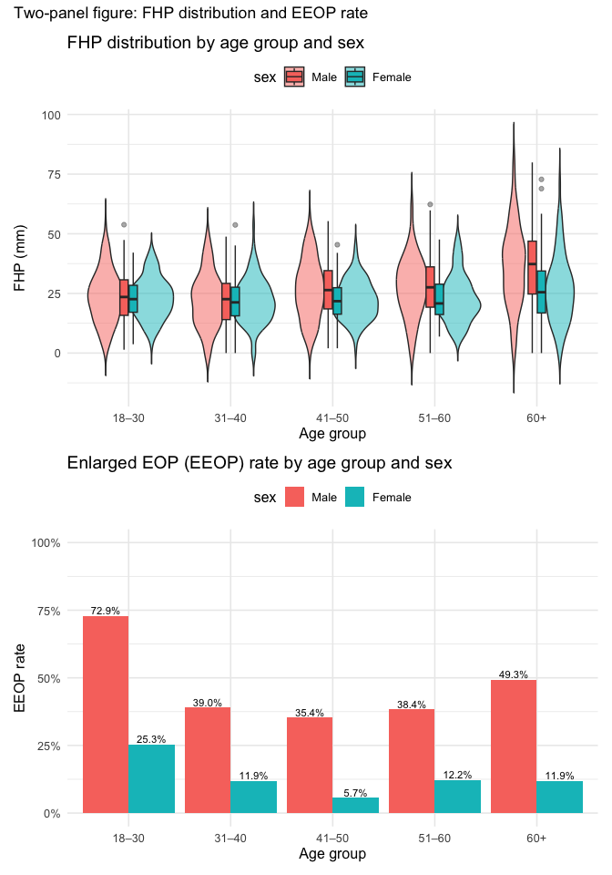
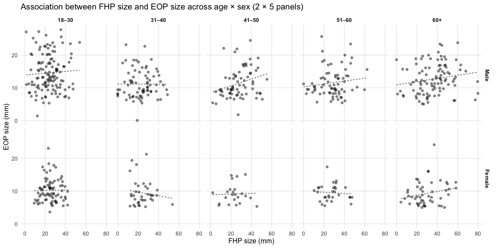

P8105 Midterm Project — EOP, FHP, Age, and Sex
================
Yongyan Liu (yl6107)

- [Introduction](#introduction)
- [Problem 1 — Import & clean data](#problem-1--import--clean-data)
- [Problem 2 — Better plots](#problem-2--better-plots)
- [Problem 3 — Discussion](#problem-3--discussion)

``` r
library(tidyverse)
library(readxl)
library(janitor)
library(broom)
library(scales)
library(patchwork)
```

## Introduction

This project is about posture and a head bump called the **external
occipital protuberance (EOP)**. This analysis refers to the [original
paper](https://www.nature.com/articles/s41598-018-21625-1) and its
[correction](https://www.nature.com/articles/s41598-019-49153-6).

We use a dataset that came with the authors’ correction. We will clean
the data, make some better plots and check the claims by the original
author.

## Problem 1 — Import & clean data

Read the Excel file from `data/`.

Missing **age_group** are filled, but we did **not** fill the missing
data for the column **EOP size** and **FHP size**.

**In these two *“size”* coloumns, most of the rows with a missing
*“size”* value have a corresponding *“category”* value as “0”.** It is
unclear whether this “0” indicates that the participant actually belongs
to category “0” or if it represents a missing or “N/A” value. We should
just exclude those rows from the analysis.

``` r
path_xlsx <- "data/p8105_mtp_data.xlsx"
stopifnot(file.exists(path_xlsx))

raw <- read_excel(path_xlsx, sheet = "this one", skip = 8) |>
  clean_names()

# Standardize core columns
dat <- raw |>
  rename(
    sex_num      = sex,
    age_years    = age,
    eop_mm       = eop_size_mm,
    eop_cat_raw  = eop_size,
    eop_vis      = eop_visibility_classification,
    eop_shape    = eop_shape,
    fhp_mm       = fhp_size_mm,
    fhp_cat      = fhp_category
  ) |>
  mutate(
    sex = case_when(sex_num == 1 ~ "Male",
                    sex_num == 0 ~ "Female",
                    TRUE ~ as.character(sex_num)),
    sex = factor(sex, levels = c("Female", "Male")),
    age_group = case_when(
      age_group == 2 ~ "18–30",
      age_group == 3 ~ "31–40",
      age_group == 4 ~ "41–50",
      age_group == 5 ~ "51–60",
      age_group %in% c(6, 7, 8) ~ "60+",
      # if missing, compute from age_years
      TRUE ~ case_when(
        age_years <= 30 ~ "18–30",
        age_years <= 40 ~ "31–40",
        age_years <= 50 ~ "41–50",
        age_years <= 60 ~ "51–60",
        age_years > 60  ~ "60+",
        TRUE ~ NA_character_
      )
    ) |> factor(levels = c("18–30","31–40","41–50","51–60","60+"), ordered = TRUE),
    eop_cat = as.integer(eop_cat_raw),
    fhp_cat = as.integer(fhp_cat),
    # Enlarged EOP per assignment: categories 2–5 are "enlarged"
    eeop = (eop_cat >= 2)
  ) |>
  mutate(
    # EOP: compare mm to categorical (only when BOTH present)
    eop_mismatch = !is.na(eop_mm) & !is.na(eop_cat) &
      (eop_mm < eop_cat * 5 | eop_mm > (eop_cat + 1) * 5),
    
    # FHP: compare mm to categorical (only when BOTH present)
    fhp_mismatch = !is.na(fhp_mm) & !is.na(fhp_cat) &
      (fhp_mm < fhp_cat * 10 | fhp_mm > (fhp_cat + 1) * 10),

    # Mark invalid rows
    invalid = eop_mismatch | fhp_mismatch
  ) |>
  select(sex, age_years, age_group, eop_mm, eop_cat, eeop, eop_vis, eop_shape, fhp_mm, fhp_cat, eop_mismatch, fhp_mismatch, invalid)
```

Total \# participants / age and gender distribution:

``` r
# Quick sanity checks
n_total <- nrow(dat)
n_by_sex_age <- dat |>
  count(sex, age_group, name = "n") |>
  mutate(p = n / sum(n))

knitr::kable(
  n_by_sex_age,
  digits = 3,
  caption = paste0("**Table**: Participants by sex and age group")
)
```

| sex    | age_group |   n |     p |
|:-------|:----------|----:|------:|
| Female | 18–30     | 152 | 0.124 |
| Female | 31–40     | 102 | 0.084 |
| Female | 41–50     | 106 | 0.087 |
| Female | 51–60     |  99 | 0.081 |
| Female | 60+       | 155 | 0.127 |
| Male   | 18–30     | 152 | 0.124 |
| Male   | 31–40     | 102 | 0.084 |
| Male   | 41–50     | 102 | 0.084 |
| Male   | 51–60     | 101 | 0.083 |
| Male   | 60+       | 150 | 0.123 |

**Table**: Participants by sex and age group

**Notes.**

- Total participants = 1221
- Age groups are ordered from **18–30** up to **60+**.
- We use **EEOP = TRUE** if **EOP category ≥ 2** from the definition in
  the article.
- For EOP size, we tolerate the missing rows for now, but, if the value
  of **eop_mm** and **eop_cat** are contradictory to each other, we mark
  the row as **invalid**. FHP is also treated in the same way.

Here is a summary about the invalid rows. They are directly removed from
the data set.

``` r
# Summaries required in step 2
mismatch_summary <- dat %>%
  summarise(
    eop_mm_vs_cat_mismatch   = sum(eop_mismatch, na.rm = TRUE),
    fhp_mm_vs_cat_mismatch   = sum(fhp_mismatch, na.rm = TRUE),
    all_matched_ok_rows      = sum(!invalid, na.rm = TRUE),
    total_rows               = n()
  )

print(mismatch_summary)
```

    ## # A tibble: 1 × 4
    ##   eop_mm_vs_cat_mismatch fhp_mm_vs_cat_mismatch all_matched_ok_rows total_rows
    ##                    <int>                  <int>               <int>      <int>
    ## 1                     14                     27                1180       1221

``` r
# remove the invlid rows
dat <- dat |> 
  filter(!invalid) |>
  filter(!is.na(age_years)) |>
  select(-eop_mismatch, -fhp_mismatch, -invalid)
```

## Problem 2 — Better plots

Optimize the data plots in the original paper.

``` r
# FHP distribution (violin + box), by age and sex
p_fhp <- dat |>
  filter(!is.na(fhp_mm)) |>
  ggplot(aes(x = age_group, y = fhp_mm, fill = sex)) +
  geom_violin(trim = FALSE, alpha = 0.5) +
  geom_boxplot(width = 0.18, outlier.alpha = 0.4,
               position = position_dodge2(width = 0.9)) +
  labs(x = "Age group", y = "FHP (mm)",
       title = "FHP distribution by age group and sex") +
  theme_minimal(base_size = 12) +
  theme(legend.position = "top")

# Calculate EEOP rate by eage and sex
eeop_by <- dat |>
  group_by(sex, age_group) |>
  summarise(n = dplyr::n(),
            rate_eeop = mean(eeop, na.rm = TRUE), .groups = "drop")

p_rate <- eeop_by |>
  ggplot(aes(x = age_group, y = rate_eeop, fill = sex)) +
  geom_col(position = position_dodge(width = 0.9)) +
  geom_text(aes(label = percent(rate_eeop, accuracy = 0.1)),
            position = position_dodge(width = 0.9),
            vjust = -0.25, size = 3) +
  scale_y_continuous(labels = percent_format(accuracy = 1), limits = c(0, 1)) +
  labs(x = "Age group", y = "EEOP rate",
       title = "Enlarged EOP (EEOP) rate by age group and sex") +
  theme_minimal(base_size = 12) +
  theme(legend.position = "top")

p_fhp / p_rate + plot_annotation(title = "Two-panel figure: FHP distribution and EEOP rate")
```

<!-- -->

The plot below shows the correlation between EOP size and FHP by age and
sex.

``` r
# filter out rows without eop_mm and fhp_mm data
dat_scatter <- dat |> filter(!is.na(eop_mm) & !is.na(fhp_mm))

# dot plot (scatter), optional faint linear trend to show association
p_scatter <- ggplot(
  dat_scatter,
  aes(x = fhp_mm, y = eop_mm)
) +
  geom_point(alpha = 0.45, size = 1.6) +
  # comment next line if you want strictly "dots only"
  geom_smooth(method = "lm", se = FALSE, linewidth = 0.6, linetype = "22", color = "grey40") +
  facet_grid(rows = vars(sex), cols = vars(age_group)) +
  labs(
    x = "FHP size (mm)",
    y = "EOP size (mm)",
    title = "Association between FHP size and EOP size across age × sex (2 × 5 panels)"
  ) +
  theme_minimal(base_size = 12) +
  theme(
    strip.text = element_text(face = "bold"),
    panel.grid.minor = element_blank()
  )

p_scatter
```

<!-- -->

Overall, males show a clearly higher rate of enlarged external occipital
protuberance (EEOP) than females across all age groups.

The range and distribution of forward head posture (FHP) values are
generally similar between men and women, although males tend to have
slightly wider variability.

Across all panels, there is no obvious visual association between FHP
size and EOP size — dots are scattered rather randomly, and no
consistent trend appears.

## Problem 3 — Discussion

The authors’ reported sample sizes for each age group are broadly
consistent with our dataset. However, many records lack either *EOP* or
*FHP* values, so only about 56.1% of the total sample can be used for
EOP/FHP correlation analyses.

The reported mean and SD of FHP are similar to ours (mean =25.6 mm, SD
=12.5 mm).

EEOP is defined as *EOP category ≥ 2* or roughly *EOP ≥ 10 mm*. Using
this definition, the EEOP prevalence in our data is 31.1%, close to the
reported 33%. But, if we exclude all the participants with missing **EOP
Size** value, the EEOP prevalence becomes 55%.

Among subjects ≥ 60 years, the proportion with high forward head posture
(FHP \> 40 mm) is 30.8%, similar to the reported 34.5%.

Overall, the data reproduce the main descriptive findings, but missing
values weaken the analysis.

No clear link between FHP and EOP size is visible, so the dataset does
not support a causal claim that cell-phone use causes “horn” growth.
Future work should include measured phone-use exposure and longitudinal
tracking.
